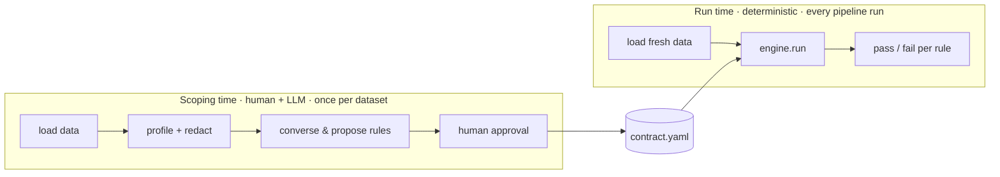

# dq-agent

[](https://github.com/JBarone90/dq-agent/actions/workflows/tests.yml)


**dq-agent is a Python toolkit for defining and running data-quality checks on a dataset.** You point it at your data and describe its business context; it profiles the data and helps you assemble a **contract** — a list of quality rules with parameters. You approve the contract once, and from then on it runs **deterministically** on every pipeline run, returning pass/fail per rule.

A large language model helps you _author_ the contract through a conversation, but it **never touches your data at execution time**. Approved rules run as ordinary, tested Python — not prompts. The LLM is a reasoning layer for scoping, not an execution engine.

It ships as a **library** (`import dq_agent`) plus a **LangGraph dev server** for the optional chat interface — there is no CLI yet.

> **Why not Great Expectations or Soda?** Those are excellent execution frameworks. dq-agent is about the step _before_ execution: turning a dataset owner's knowledge into a tested rule suite through conversation, while keeping the contract format portable and owned by this tool (export adapters to other frameworks can be added later). The deterministic engine here is deliberately small — the differentiator is the curated rule registry and the scoping workflow.

## Status

This is a phased build; here's what is real today:

| Capability                              | State                          |
| --------------------------------------- | ------------------------------ |
| Rule registry + execution engine        | **Done** — tested, usable      |
| Deterministic profiler (CSV + Postgres) | **Done** — tested, usable      |
| Scoping agent + human approval gate     | **Working dev demo** (Phase 3) |
| Creative mode — novel rule proposals    | Planned (Phase 4)              |

The deterministic core (engine, profiler, registry, report) is complete and covered by tests. The conversational scoping agent runs locally against any LangChain-supported model and persists approved contracts; it is a working demo rather than a hardened product. See [ACTION_PLAN.md](ACTION_PLAN.md) for the full roadmap.

## Contents

### Guide

- [How it works](#how-it-works)
- [Quickstart](#quickstart)
- [The scoping agent](#the-scoping-agent)
- [Project structure](#project-structure)

### Concepts

- [The deterministic layer](#the-deterministic-layer)
- [The agentic layer](#the-agentic-layer)

### For developers

- [Development & testing](#development--testing)
- [Anatomy of a rule](#anatomy-of-a-rule)
- [Design principles](#design-principles)

## How it works

Everything in the tool belongs to one of two phases that never overlap in time. They share only two things: **connectors** (both start by loading data into a Polars DataFrame) and the **contract YAML** (one phase produces it, the other consumes it).

```text
SCOPING TIME — once per dataset, human in the loop, LLM allowed
  load data  →  profile (+ redact)  →  converse & propose rules  →  human approval  →  contract.yaml

RUN TIME — every pipeline run, deterministic, no LLM anywhere
  load fresh data  +  approved contract.yaml  →  engine.run()  →  pass/fail per rule
```



The profiler informs which rules to _propose_; the engine _executes_ what was approved. The engine never profiles, the profiler never executes, and the LLM never touches either — at scoping time it only ever sees a **redacted** profiler report (aggregates and hints, no raw cell values).

## Quickstart

**Requirements:** Python ≥ 3.11 and [uv](https://docs.astral.sh/uv/).

```bash
uv sync            # install the core library
```

The repo ships a dirty-by-design dataset (`data/synthetic/orders.csv` — 20 order rows with known issues: null customer ids, a duplicate order id, a negative amount, a malformed email, an unexpected status, a stale date) and an approved contract for it (`contracts/examples/orders.yaml`). Running that contract against the data is three lines:

```python
from pathlib import Path

from dq_agent.connectors import load_csv
from dq_agent.engine import run
from dq_agent.models import Contract
from dq_agent.registry import Registry

df = load_csv("data/synthetic/orders.csv")
contract = Contract.from_yaml(Path("contracts/examples/orders.yaml"))
results = run(contract, df, Registry(Path("registry/rules")))
```

`results` is a `list[RuleResult]` your pipeline can gate on directly. Every baked-in issue is caught:

```text
min_row_count   PASS  0.00     # 20 rows, threshold is 10
null_check      FAIL  0.10     # 2 of 20 customer_id values are null
unique_check    FAIL  0.05     # order_id 1001 appears twice
range_check     FAIL  0.05     # one negative amount
allowed_values  FAIL  0.05     # status 'refunded' not in the approved set
regex_match     FAIL  0.05     # 'not-an-email'
freshness       FAIL  0.05     # one order from 2020
```

For a formatted, human-readable version of this, pass the results to `report.render()` — see the [Report](#report) concept.

## The scoping agent

Phase 3 wraps the scoping workflow in a single LangGraph agent (`src/dq_agent/agents/scoping.py`). It converses with the dataset owner, profiles the dataset (`profile_dataset` — redacted report only, no raw cell values ever reach the LLM), browses the registry (`list_rules`), and proposes a draft contract (`propose_contract`, validated against the registry). Approval is a LangGraph `interrupt()`: the graph pauses, a human accepts / edits / responds, and only an accepted contract is stamped (`approved_at`, `approved_by`), given a schema snapshot, and persisted to `contracts/<dataset>.yaml` — directly executable by the engine.

The engine enforces the gate at run time: it raises `ContractNotApprovedError` for unapproved contracts and `SchemaDriftError` when the live schema no longer matches the snapshot the contract was scoped against.

### Running the chat interface

The chat UI is [agent-chat-ui](https://github.com/langchain-ai/agent-chat-ui) — LangChain's off-the-shelf client for LangGraph servers. Three steps:

**1. Configure the model.** The dev default is Gemini 3.1 Flash Lite on Google's free tier (chosen for its higher free-tier daily request allowance), whose LangChain package ships in the `agents` extra:

```bash
uv sync --extra agents
cp .env.example .env       # then put your GOOGLE_API_KEY in .env
```

Get a free key at [aistudio.google.com/apikey](https://aistudio.google.com/apikey).

**The provider is a config value, not code.** At startup the agent reads `DQ_AGENT_MODEL` (a `provider:model` string) from `.env` and passes it to LangChain's `init_chat_model`, which dynamically imports the matching `langchain-<provider>` integration. Switching providers is two steps, no code changes:

| Provider         | Add the package              | Set in `.env`                                                          |
| ---------------- | ---------------------------- | ---------------------------------------------------------------------- |
| Google (default) | _(bundled)_                  | `DQ_AGENT_MODEL=google_genai:gemini-3.1-flash-lite` + `GOOGLE_API_KEY=...`  |
| Anthropic        | `uv add langchain-anthropic` | `DQ_AGENT_MODEL=anthropic:claude-sonnet-4-6` + `ANTHROPIC_API_KEY=...` |
| OpenAI           | `uv add langchain-openai`    | `DQ_AGENT_MODEL=openai:gpt-4o` + `OPENAI_API_KEY=...`                  |
| Ollama (local)   | `uv add langchain-ollama`    | `DQ_AGENT_MODEL=ollama:qwen3:8b` _(no key)_                            |

If the chosen provider's package or API key is missing, the agent fails fast at startup with a message pointing you at the provider's `langchain-*` package and `.env` key.

**2. Serve the graph.** From the repo root:

```bash
uv run langgraph dev       # serves the 'scoping' graph at http://localhost:2024
```

**3. Connect a chat client.** Quickest is the hosted client — open [agentchat.vercel.app](https://agentchat.vercel.app) and fill in:

- Deployment URL: `http://localhost:2024`
- Assistant / Graph ID: `scoping`
- LangSmith API key: leave empty (not needed for a local server)

Or run the UI locally instead:

```bash
git clone https://github.com/langchain-ai/agent-chat-ui.git
cd agent-chat-ui
pnpm install && pnpm dev   # then open http://localhost:3000 and enter the same values
```

Then chat: point the agent at `data/synthetic/orders.csv`, describe the business context, and iterate on its proposal. When you confirm, the approval gate renders as an interrupt card (approve / edit / reject); approving writes the approved contract to `contracts/<dataset>.yaml`.

> **Free-tier rate limits:** a single scoping turn makes several model requests (the agent loop calls the model once per tool round), so Gemini's free-tier requests-per-minute cap is easy to hit mid-conversation. The default `gemini-3.1-flash-lite` is chosen partly for its higher free-tier allowance; if you still see 429s, wait a minute and continue (the thread keeps its state), or switch `DQ_AGENT_MODEL` to another model.

The approval interrupt follows agent-chat-ui's HITL schema (`action_requests` + `review_configs`, tracking the current agent-chat-ui `main`), so the UI renders the contract review (approve / edit / reject) natively instead of as raw JSON. If you connect a client still on the older `HumanInterrupt` schema and see the raw interrupt payload, type `approve` (or your feedback) as free text — the gate accepts a text response as well as the rendered controls.

## Project structure

```text
dq-agent/
├── src/dq_agent/
│   ├── registry.py     # loads + indexes rule YAML; validates params; resolves rule_id -> callable
│   ├── engine.py       # runs an approved contract against a DataFrame (deterministic, no LLM)
│   ├── models.py       # Contract, ContractRule, RuleResult — shared Pydantic models
│   ├── profiler.py     # dataset profiler + redact() — scoping-time facts for the LLM
│   ├── connectors.py   # load CSV / Parquet / Postgres into a Polars DataFrame
│   ├── report.py       # render() — list[RuleResult] -> human-readable report
│   ├── harness.py      # scores a proposed contract vs expected failures (recall / precision)
│   ├── rules/          # rule functions, one module per DQ category
│   └── agents/         # LangGraph scoping agent + human approval gate (Phase 3)
├── registry/rules/     # rule definitions as YAML — the catalogue the agent draws from
├── contracts/
│   ├── examples/       # hand-written example contracts (orders.yaml)
│   └── <dataset>.yaml  # approved contracts the scoping agent persists land here
├── proposals/          # creative-mode (Phase 4) outputs — empty until that phase lands
├── data/synthetic/     # dirty-by-design test dataset (orders.csv)
└── tests/
```

**Polars is the internal representation.** Connectors load into a Polars DataFrame before any profiling or rule execution runs — raw DB cursors and pandas frames never reach the engine.

## Concepts

The toolkit is two layers. The **data-quality layer** defines and runs checks with no LLM involved — it works entirely on its own. The **scoping layer** sits on top and is how an LLM helps a human author a contract for that lower layer to run.

### The deterministic layer

These run on every pipeline execution, no LLM anywhere. They build up from the smallest unit to a dataset-specific suite: a **rule** is one check, the **registry** is the collection of all rules, and a **contract** is a chosen subset of them with parameters.

#### Rule

**The smallest unit — one check.** A rule is two artifacts sharing an id: a YAML definition (discoverable metadata and a parameter spec) and a pure Python function (Polars DataFrame in, `RuleResult` out, no side effects). For example, `null_check` fails when a column's null rate exceeds a threshold. Full breakdown in [Anatomy of a rule](#anatomy-of-a-rule).

#### Registry

**The collection of every available rule.** At startup the registry (`registry.py`) loads every rule YAML in `registry/rules/` and indexes it by id (exposing tags for filtering). It is the single source of truth for _what rules exist and how each is configured_: it validates parameters against a rule's spec and resolves a `rule_id` to its callable. The engine routes everything through it, so adding a rule never touches the engine — you drop in a YAML file and a function.

#### Contract

**A parameterized subset of registry rules, approved by a human.** A contract selects rules from the registry for one specific dataset and pins their parameters (which column, what threshold), plus optional per-rule severity overrides and the approval metadata that gates execution. It is the **boundary object** — the one artifact the scoping layer produces and the deterministic layer consumes:

```yaml
dataset: orders
approved_at: 2026-06-12T00:00:00Z # the engine refuses to run without this
approved_by: jacopo
columns: # schema snapshot at approval time
  order_id: Int64
  customer_id: String
  # ...
rules: # each entry = one registry rule + its params
  - rule_id: null_check
    params: { column: customer_id, max_null_rate: 0.0 }
  - rule_id: unique_check
    params: { column: order_id }
```

`columns` is a schema snapshot: at run time the engine compares it against the live schema and raises `SchemaDriftError` if they no longer match — a contract-lifecycle event that routes the owner back to re-scoping, not a per-rule failure.

#### Report

**Results, made legible.** The report module (`report.py`) turns the engine's `list[RuleResult]` into a human-readable summary, joining results with the contract (for parameters) and registry (for rule names) so the output reads without engineering knowledge. `render()` on the Quickstart results produces:

```text
Dataset: orders  |  Run: 2026-06-15 11:19 UTC

1 of 7 rules passed, 6 failed.

PASSED
  Minimum Row Count                        min 10 rows            0.0% violation rate

FAILED
  Null Check                               customer_id            10.0% violation rate
  Unique Check                             order_id               5.0% violation rate
  Range Check                              amount                 5.0% violation rate
  Allowed Values                           status                 5.0% violation rate
  Regex Match                              email                  5.0% violation rate
  Freshness Check [warning]                created_at             5.0% violation rate
```

Each result carries its _effective_ severity (the contract's per-rule override, else the registry default), so a pipeline can gate with nothing but the results — e.g. fail an Airflow task when any `error`-severity rule has `passed == False`. The `[warning]` tag above marks an advisory rule that should not block.

### The agentic layer

These exist only at scoping time, to help a human and an LLM produce a good contract for the deterministic layer above. The LLM appears only here — and even here it never sees raw data.

#### Profiler

**The agent's window into the dataset.** The profiler (`profiler.py`) is the main tool the agent uses to reason about data it cannot see directly. `profile()` produces a structured report — per-column stats, table stats, and semantic hints — that tells the agent _which rules are worth proposing_: a column hinted `email` with a few malformed values suggests a `regex_match`; a high null rate suggests a `null_check`. Per-column stats include null rate, uniqueness, min/max, and distribution; semantic hints cover `email`, `phone`, `id`, and `date`. It is pure, deterministic code; the LLM consults its output, it does not run it.

#### Redaction

**The data-protection boundary between the profiler and the LLM.** A full profile can contain raw cell values (e.g. the most common values in a column), which must never be sent to a model. `redact()` returns a copy that is safe to share: raw value _examples_ (top values) are dropped, while bounded aggregates (null rate, uniqueness, numeric/temporal min/max) are kept — enough signal to propose rules, no raw data. The redacted `email` column, for instance:

```json
{
  "name": "email",
  "dtype": "String",
  "null_rate": 0.0,
  "uniqueness_ratio": 1.0,
  "min": null,
  "max": null,
  "top_values": null,
  "semantic_hint": "email"
}
```

Redaction is enforced in the agent's tooling: the `profile_dataset` tool always returns the redacted report, so a raw value cannot reach the model even by accident.

#### Harness

**Regression-testing the scoping agent.** The harness (`harness.py`) scores a proposed contract against a hand-written set of expected failures, reporting **recall** (did it catch every known issue?) and **precision** (did it flag anything spurious?). It exists so that a change to the system prompt, model, or registry that silently reduces coverage of known dataset issues is caught by an assertion like `score.recall == 1.0`.

## For developers

### Development & testing

Install the optional dependency groups you need:

| Command                    | Adds                                                    |
| -------------------------- | ------------------------------------------------------- |
| `uv sync`                  | core: Polars, Pydantic, PyYAML                          |
| `uv sync --extra dev`      | pytest, pytest-cov                                      |
| `uv sync --extra postgres` | ConnectorX (Postgres connector)                         |
| `uv sync --extra agents`   | LangGraph + LangChain (the scoping agent + chat server) |

Run the suite:

```bash
uv run pytest                                          # all tests
uv run pytest tests/test_engine.py::test_run_passes_on_clean_column   # a single test
uv run pytest --cov=src/dq_agent                       # with coverage
```

Integration tests (which make live LLM calls) are marked `integration` and are deselected in CI; they self-skip locally unless `DQ_AGENT_MODEL` is set. The Postgres test (identical profiler report from a file and a live table) skips unless `DQ_TEST_POSTGRES_URI` is set. To run it against a throwaway container:

```bash
docker run -d --name dq-test-pg -e POSTGRES_PASSWORD=dq -p 5433:5432 postgres:16
docker exec dq-test-pg psql -U postgres -c "CREATE TABLE orders (
  order_id INTEGER, customer_id TEXT, email TEXT, amount DOUBLE PRECISION,
  status TEXT, created_at DATE, phone TEXT);"
cat data/synthetic/orders.csv | docker exec -i dq-test-pg psql -U postgres \
  -c "\copy orders FROM STDIN WITH (FORMAT csv, HEADER true)"

DQ_TEST_POSTGRES_URI=postgresql://postgres:dq@localhost:5433/postgres uv run pytest
docker rm -f dq-test-pg
```

**CI** runs the suite on push to `main` and on every pull request, across Python 3.11–3.13 (`.github/workflows/tests.yml`).

### Anatomy of a rule

Every rule is two artifacts that share an id: a YAML definition (what the agent and humans see) and a pure function (what the engine runs).

The YAML in `registry/rules/` carries everything needed to discover, validate, and route the rule — tags the scoping agent queries, parameter specs that contracts are validated against, a default severity, and a pointer to the implementation:

```yaml
# registry/rules/null_check.yaml
id: null_check
name: Null Check
description: Fails if the null rate in a column exceeds max_null_rate.
tags: [completeness]
severity: error
parameters:
  column: { type: str, required: true }
  max_null_rate: { type: float, default: 0.0 }
execution:
  module: dq_agent.rules.completeness
  function: null_check
```

The function in `src/dq_agent/rules/` is the implementation: Polars DataFrame in, `RuleResult` out — no side effects, no I/O, no LLM:

```python
# src/dq_agent/rules/completeness.py
def null_check(df: pl.DataFrame, *, column: str, max_null_rate: float = 0.0) -> RuleResult:
    violation_rate = df[column].null_count() / len(df)
    return RuleResult(
        rule_id="null_check",
        passed=violation_rate <= max_null_rate,
        violation_rate=violation_rate,
    )
```

A contract then activates a rule for one dataset by id, with parameters chosen during scoping:

```yaml
- rule_id: null_check
  params: { column: customer_id, max_null_rate: 0.0 }
```

For each contract entry the engine validates params against the spec (presence, unknown names, and type), resolves the callable, runs it, and folds any failure into that rule's result (`error` set, `violation_rate` null) — one broken rule never blocks the rest. On an empty dataset a column rule cannot be evaluated (zero rows would divide by zero / pass vacuously) and reports an un-evaluated result, while table-level rules like `min_row_count` still run — an empty table is exactly their concern.

Adding a rule never touches the engine: one YAML file, one function, tests. Authoring standards live in `.claude/roles/rule-author.md`.

### Design principles

- **Registry first.** The quality of the rule registry determines the quality of every contract the agent produces. Invest there.
- **Deterministic by default.** The LLM is a reasoning layer, not an execution layer. Approved rules run as code, not prompts.
- **Framework agnostic at the model layer.** LLM provider is a config value. Swap between Anthropic, OpenAI, or a local model without code changes.
- **Own the contract format.** Contracts are portable YAML. Export adapters to other DQ tools (Great Expectations, Soda) can be added later without changing the core.
